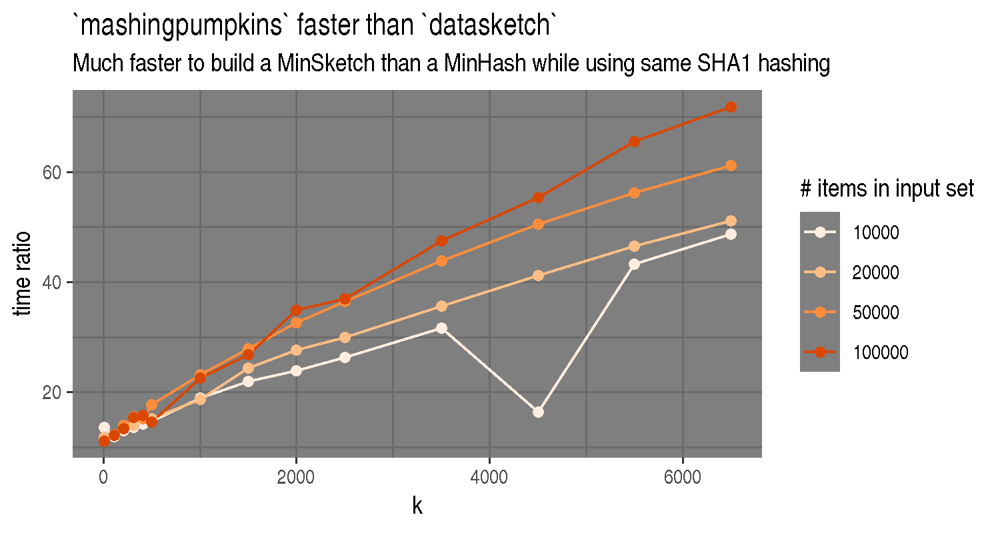

[](doc/_static/mashingpumpkins.png)
# mashing-pumpkins

Flexible-yet-pretty-fast minhashing-related library for Python >= 3.5.

[](https://travis-ci.org/lgautier/mashing-pumpkins)
[](https://codecov.io/gh/lgautier/mashing-pumpkins)
[](https://img.shields.io/pypi/v/mashing-pumpkins.svg)

The package is rather well documented with:
- Sphinx documentation in [doc/](doc/) (start with [doc/index.rst](doc/index.rst))
- Docstrings for most of the functions, classes, and methods
- A showcase notebook in [doc/notebooks](doc/notebooks) (although this needs to be refreshed)
- A demo command-line tool to build sketches in sourmash's JSON format (`python -m mashingpumpkins.demo.cmdline --help`) (although this is
  historical and need to be refreshed or deleted)

## Why Minhash sketches ?

Bottom-sketches (Minhash sketches) are samples of the elements present in a set.
They have been extensively used for text document matching or retrieval, which can
extend to the context of genomics where strings are DNA or RNA sequences. There the
set of k-mers present in a genome (called "k-shingles" in MinHash-related litterature),
or in the reads from a sequencing assay, and they have been shown to be useful to
measure similarity between genomes.

## Why this implementation ?


The purpose of this implementation is to provide a library design that is combining flexibility and expressivity with performance
(speed and memory usage).

### Design

The design is allowing us to implement with a relatively short code base:

- the use different hash functions (MurmurHash3, XXHash), and with user-specified seeds
- Minhash and Maxhash sketches
- "Count sketches"
- Demonstrate quickly the comparative efficiency of alternative hashing strategies for double-stranded genomes (see - https://github.com/marbl/Mash/issues/45#issuecomment-274665746)

### Performance

The implementation also happens to be pretty fast, making it a reasonable option as a building block for minhash-related research and prototypes.



At the time of writing it is able to build a minhash sketch (k=31, size=1000) for a FASTQ file with ~21M reads (700MB when gzip-compressed)
on a laptop[*] in under 1'30".

```bash
$ python -m mashingpumpkins.demo.cmdline --parser=fastqandfurious --ncpu=3 DRR065801.fastq.gz
Processing DRR065801.fastq.gz as a FASTQ file...
    20853697 records in 1m20s (9.43 MB/s)
```

(*: ASUS ultrabook, dual-core with hyperthreading, running Linux)

## Installation

Python 3.5, 3.6, 3.7 and a C/C++ compiler (C99-aware) are pretty much everything that is needed. At the time of writing the CI
on Travis is testing with gcc and clang on Linux and OSX.

With pip, installing either latest release or the "master" branch can be done with:

```bash
# latest release
pip install mashing-pumpkins

# master on github
pip install git+https://https://github.com/lgautier/mashing-pumpkins.git

```

The installation can be tested with:

```bash
python -m pytest --pyargs mashingpumpkins

# or:

python -m pytest --cov=mashingpumpkins ---cov-report term
```

